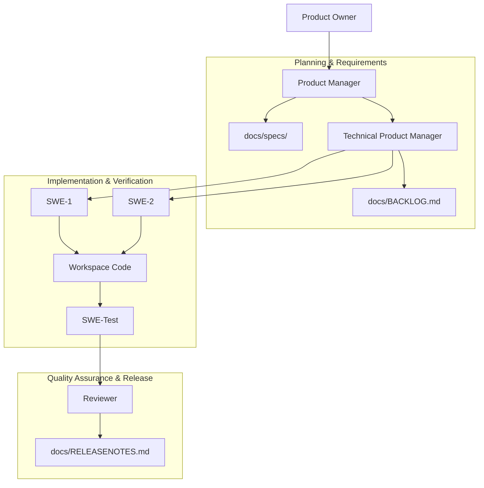

# 🤖 Scion AppTeam

> **An Autonomous, Multi-Agent Software Development Team Orchestrated by Scion**

[](https://github.com/gitrey/scion-appteam)
[]()
[]()

`scion-appteam` is an advanced, fully containerized multi-agent simulation
environment designed for autonomous software engineering. Rather than relying on
a single monolithic LLM context, it models a professional, role-based agile
software development team using specialized agents working in concert.

---

## 🎯 Project Goal

The primary goal is **autonomous end-to-end feature delivery, code quality
assurance, and project tracking**. By dividing complex engineering operations
into isolated roles (Product Management, Architecture, Engineering, Testing, and
Review), `scion-appteam`:

- **Eliminates context bloating** by keeping each agent focused strictly on
  their domain.
- **Enforces professional workflows** (specs are approved before coding begins,
  code is tested before review).
- **Enables parallel implementation** using isolated Git worktrees and
  containerized environments.

---

## 🏗️ Team Architecture & Workflow

The project simulates a complete agile lifecycle through specialized agent
personas interacting via defined messaging interfaces:



### 👥 The Personas

1. **📋 Product Manager (PM)**: Bridges the PO's feedback/requests and the
   technical team. Focuses on creating specs under `docs/specs/` and detailing
   acceptance criteria.
2. **⚙️ Technical Product Manager (TPM)**: Manages `docs/BACKLOG.md` and
   orchestrates SWE assignments, priority, and task completion.
3. **💻 Software Engineers (SWE-1 & SWE-2)**: Specialize in direct codebase
   implementation, resolving requirements according to approved specs.
4. **🧪 Software Engineer Test (SWE-Test)**: Responsible for generating unit,
   integration, and end-to-end tests to verify acceptance criteria.
5. **🔍 Reviewer**: Performs comprehensive code reviews and grants approval
   before changes are finalized.

---

## 📂 Project Structure

```typescript
scion-appteam/
├── .scion/                  // Scion orchestration settings
│   └── templates/           // Agent templates & custom prompts
│       ├── pm/              // Product Manager configurations & skills
│       ├── reviewer/        // Reviewer configurations & skills
│       ├── swe-1/           // Software Engineer 1 configurations & skills
│       ├── swe-2/           // Software Engineer 2 configurations & skills
│       ├── swe-test/        // QA/Testing configurations & skills
│       └── tpm/             // Technical Product Manager configurations & skills
├── docs/                    // Shared documentation & agile tracking (to be created)
│   ├── specs/               // Feature specifications & requirements
│   ├── adr/                 // Architecture Decision Records
│   ├── BACKLOG.md           // Global product backlog
│   ├── PROGRESS.md          // Active work item status
│   └── RELEASENOTES.md      // Completed milestones & version history
└── README.md                // Project overview (this file)
```

---

## 🛠️ Key Agent Skills

Each agent template is equipped with specialized `/` skills designed to automate
common software processes:

- **`/pipeline`** (PM/TPM/SWE): Spins up the full agent team, creates tasks, and
  initiates the structured workflow in dedicated execution panes.
- **`/adr`** (SWE-Test/PM/Reviewer): Automates the creation of Architecture
  Decision Records under `docs/adr/` with standard templates.
- **`/regenerate`** (PM): Reads project configurations from
  `.appteam/settings.json` and automatically regenerates template structures
  while preserving core tracking files.
- **`/release`** (PM): Automates release note aggregation and version tagging
  upon milestone completion.

---

## 🚀 Getting Started

### 1. Initialize the Environment

Set up your Scion workspace:

```bash
scion init
```

### 2. Trigger the Pipeline

Spawn the entire autonomous development team with a specific feature target:

```bash
# Initiates the autonomous agile flow for a new feature
/pipeline "Implement dark mode support across the application"
```

### 3. Document Architectural Decisions

To propose a new architectural change:

```bash
/adr "Use PostgreSQL for order management persistence"
```

---

_Developed with 🦾 using the
[Scion Framework](https://github.com/gitrey/scion-appteam)._
