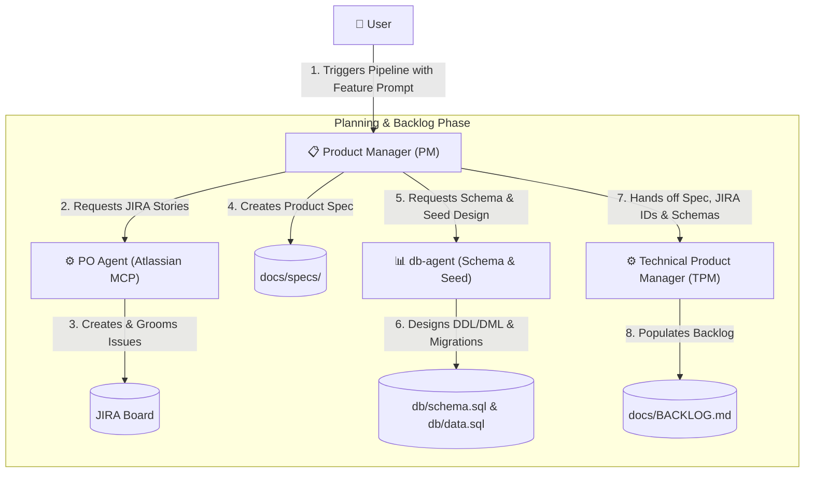
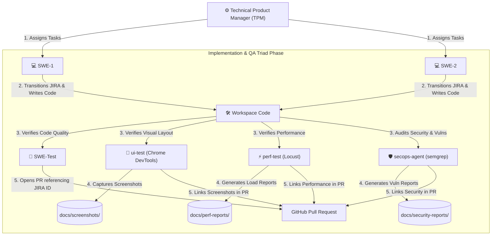
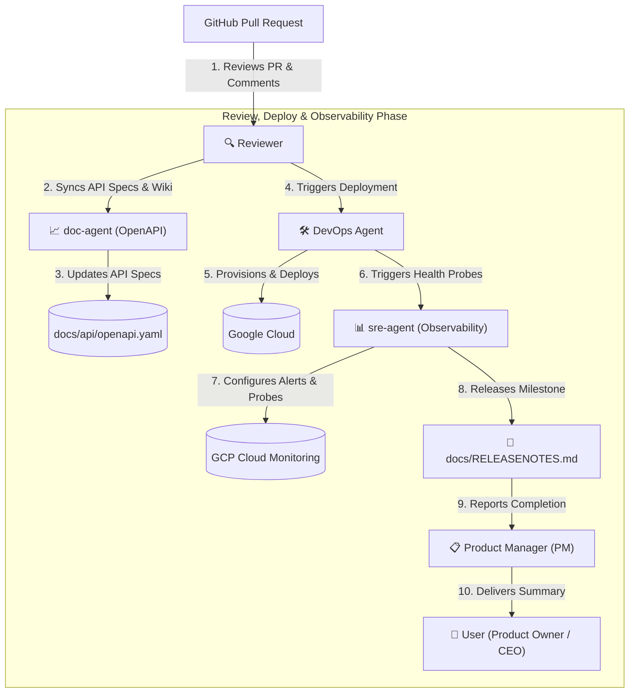
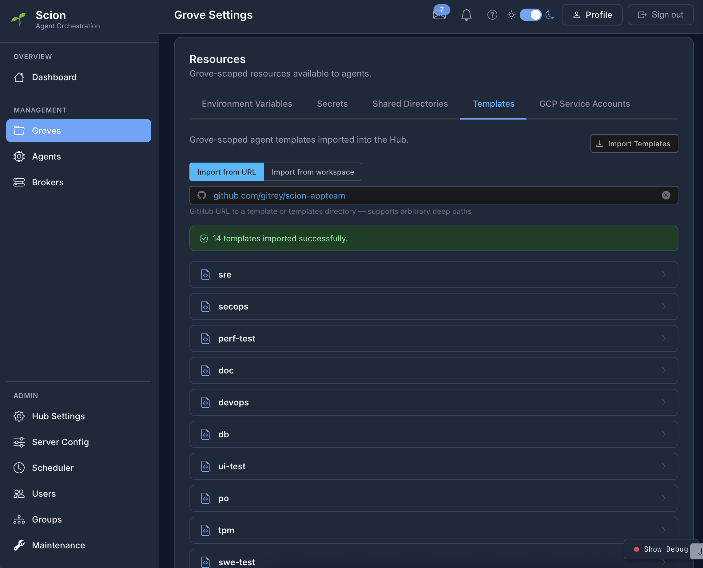

# 🤖 Scion AppTeam

> **An Autonomous, Multi-Agent Software Development Team Orchestrated by Scion**

[](https://github.com/gitrey/scion-appteam)
[]()
[]()

`scion-appteam` is an advanced, fully containerized multi-agent simulation
environment designed for autonomous software engineering. Rather than relying on
a single monolithic LLM context, it models a professional, role-based agile
software development team using specialized agents working in concert.

---

## 🎯 Project Goal

The primary goal is **autonomous end-to-end feature delivery, code quality
assurance, and project tracking**. By dividing complex engineering operations
into isolated roles (Product Management, Architecture, Engineering, Testing, and
Review), `scion-appteam`:

- **Eliminates context bloating** by keeping each agent focused strictly on
  their domain.
- **Enforces professional workflows** (specs are approved before coding begins,
  code is tested before review).
- **Enables parallel implementation** using isolated Git worktrees and
  containerized environments.

---

## 🏗️ Team Architecture & Workflow

The project demonstrates a complete agile software development lifecycle through
specialized agent personas interacting via defined messaging interfaces:

#### **Phase 1: Planning & Backlog Creation**


#### **Phase 2: Implementation & Quality Assurance (QA)**


#### **Phase 3: Review, Deployment & Observability**


### 👥 The Personas

#### **📋 Planning & Backlog Team**
- **📋 Product Manager (PM):** The primary entry point for users; drafts product specs and orchestrates the high-level pipeline.
- **👤 Product Owner (PO):** Manages the JIRA backlog, translating specs from the PM into JIRA stories using native Atlassian MCP tools.
- **📊 Database & Data Specialist Agent (db):** Designs logical DDL schemas and generates test seed data (DML) once specs are approved and before tasks are assigned.
- **⚙️ Technical Product Manager (TPM):** Breaks down specs, database schemas, and JIRA IDs into granular tasks in `docs/BACKLOG.md` and coordinates assignments.

#### **💻 Engineering & Implementation Team**
- **💻 Software Engineer 1 (swe-1):** Specializes in CLI, Wizard, interactive prompts, and input validation on feature branches.
- **💻 Software Engineer 2 (swe-2):** Specializes in text/template rendering, file generation, and data structures on feature branches.

#### **🧪 Quality Assurance (QA) & Security Team**
- **🧪 Software Engineer Test (SWE-Test):** Responsible for generating unit, integration, and end-to-end tests to verify acceptance criteria.
- **🎨 UI Test Automation Agent (ui-test):** Specializes in automated browser testing, DOM/CSS inspection, visual verification, and screenshot audits using the Chrome DevTools MCP.
- **⚡ Performance Testing Engineer Agent (perf-test):** Specializes in concurrent traffic simulation (Locust), scalability audits, response time/latency profiling (p50, p95, p99), and performance metrics reporting.
- **🛡️ AppSec & SecOps Agent (secops):** Specializes in Static Application Security Testing (SAST via `gosec`/`semgrep`), dependency vulnerability audits (SCA via `govulncheck`), and secret scanning.

#### **🚀 Review, Release & Operations Team**
- **🔍 Reviewer:** Performs comprehensive code reviews, grants approvals, and reviews Pull Requests via `gh` CLI, leaving final merges for human engineers.
- **📈 Technical Writer Agent (doc):** Specializes in generating and maintaining OpenAPI/Swagger schemas (`openapi.yaml`), interactive component diagrams (Mermaid), and architectural wikis upon PR review.
- **🛠️ DevOps Engineer Agent (devops):** Specializes in declarative infrastructure provisioning (Terraform), container orchestration (Kubernetes YAML), and secure automated cloud deployments (using `gcloud` to Cloud Run).
- **🩺 Site Reliability Engineer Agent (sre):** Specializes in post-deployment liveness/readiness HTTP audits (`/healthz`, `/readyz`), provisioning GCP alerting policies via Terraform, and documenting SLOs/SLIs.

---

## 📂 Project Structure

```typescript
scion-appteam/
├── .scion/                  // Scion orchestration settings
│   └── templates/           // Agent templates & custom prompts
│       ├── po/              // Product Owner configuration, system prompt & JIRA skills
│       │   └── skills/      // PO JIRA skills (/story, /groom)
│       ├── pm/              // Product Manager configurations & skills
│       ├── reviewer/        // Reviewer configurations & skills
│       ├── swe-1/           // Software Engineer 1 configurations & skills
│       ├── swe-2/           // Software Engineer 2 configurations & skills
│       ├── swe-test/        // QA/Testing configurations & skills
│       ├── ui-test/         // UI Test Automation Agent configuration, prompt & skills
│       │   └── skills/      // UI Test skills (/visual-verify)
│       ├── devops/          // DevOps Engineer Agent configuration, prompt & skills
│       │   └── skills/      // DevOps skills (/deploy, /logs)
│       ├── perf-test/       // Performance Testing Agent configuration, prompt & skills
│       │   └── skills/      // Performance skills (/locust)
│       ├── secops/          // AppSec/Security Agent configuration, prompt & skills
│       │   └── skills/      // Security skills (/audit)
│       ├── doc/             // Tech Writer Agent configuration, prompt & skills
│       │   └── skills/      // Documentation skills (/openapi)
│       ├── sre/             // SRE Agent configuration, prompt & skills
│       │   └── skills/      // Reliability skills (/health)
│       ├── db/              // Database & Data Agent configuration, prompt & skills
│       │   └── skills/      // Database skills (/seed)
│       └── tpm/             // Technical Product Manager configurations & skills
├── db/                      // Database schemas & test data migrations
│   ├── schema.sql           // Logical DDL relational schema
│   ├── data.sql             // Relational DML test seed dataset
│   └── migrations/          // Sequential SQL migrations
├── docs/                    // Shared documentation & agile tracking
│   ├── specs/               // Feature specifications & requirements
│   ├── adr/                 // Architecture Decision Records
│   ├── BACKLOG.md           // Global product backlog
│   ├── PROGRESS.md          // Active work item status
│   ├── RELEASENOTES.md      // Completed milestones & version history
│   ├── perf-reports/        // Headless Locust performance HTML reports
│   ├── security-reports/    // Gosec and dependency vulnerability JSON logs
│   ├── reliability/         // Availability, SLO/SLI documentation wikis
│   └── api/                 // OpenAPI/Swagger specifications (openapi.yaml)
└── README.md                // Project overview (this file)
```

---

## 🛠️ Key Agent Skills

Each agent template is equipped with specialized `/` skills designed to automate
common software processes:

- **`/story`** (PO): Automates creation of highly-structured JIRA stories and
  bugs with testable acceptance criteria via the Atlassian MCP server.
- **`/groom`** (PO): Performs comprehensive JIRA backlog grooming, auditing
  ticket descriptions, and refining priorities dynamically.
- **`/visual-verify`** (ui-test): Automates end-to-end visual QA and browser
  interactions, capturing state screenshots via Chrome DevTools MCP.
- **`/locust`** (perf-test): Executes headless Locust load tests simulating high
  concurrent user traffic, profiling response time latencies (p50, p95, p99)
  non-interactively.
- **`/seed`** (db): Automates relational database schema design (DDL) and
  generates rich, interconnected test seed data datasets (DML)
  non-interactively.
- **`/audit`** (secops): Automates static code security scans
  (`gosec`/`semgrep`) and dependency vulnerability analysis (`govulncheck`)
  non-interactively.
- **`/openapi`** (doc): Scans implemented paths and models to generate and
  synchronize OpenAPI schemas (`openapi.yaml`) and visual request sequence maps
  automatically.
- **`/health`** (sre): Audits deployed microservice health probes
  (`/healthz`/`/readyz`) and automatically provisions Cloud Monitoring alert
  policies via Terraform.
- **`/deploy`** (devops): Builds container images, provisions GCP infrastructure
  via Terraform, and deploys microservices to Cloud Run non-interactively.
- **`/logs`** (devops): Automatically queries and audits application logs from
  Cloud Run or GKE pods to isolate technical blockers.
- **`/pipeline`** (PM/TPM/SWE): Spins up the full agent team, creates tasks, and
  initiates the structured workflow in dedicated execution panes.
- **`/adr`** (SWE-Test/PM/Reviewer): Automates the creation of Architecture
  Decision Records under `docs/adr/` with standard templates.
- **`/regenerate`** (PM): Reads project configurations from
  `.appteam/settings.json` and automatically regenerates template structures
  while preserving core tracking files.
- **`/release`** (PM): Automates release note aggregation and version tagging
  upon milestone completion.

---

## 🚀 Getting Started

### 📦 Import Agent Templates

To import and register pre-configured specialized agent templates into
your active Scion Grove:

1. Open the **Settings** menu for your Scion Grove.
2. Select **Resources / Templates**.
3. Provide the repository source URL:
   ```text
   https://github.com/gitrey/scion-appteam
   ```
4. Click "Import Templates" and wait for the import to complete.

Once imported, all roles (PO, PM, TPM, SWEs, QA Triad, DevOps, SRE, and SecOps) will be immediately configured and ready to orchestrate!



